# Booker API - Sistema de Gestión de Reservas

## Descripción del Proyecto

Booker API es una API RESTful educativa construida con CodeIgniter 4 para gestionar reservas de un restaurante ficticio. El objetivo de este proyecto es enseñar, paso a paso, cómo levantar una API sin frontend, modelar una base de datos en SQLite, exponer endpoints CRUD y validarlos con Postman dentro de un entorno GitHub Codespaces.

## Instalación y Configuración Inicial

La historia comienza en un Codespace con PHP 8.3 y Composer 2.8. Primero se creó el esqueleto con CodeIgniter 4 (v4.6.3) y, como suele ocurrir en entornos remotos, apareció un problema clásico: la extensión intl no estaba habilitada en la instalación de PHP que usa Composer dentro del contenedor. La solución fue enlazar el módulo adecuado y activar la extensión en el directorio de extensiones de la instalación activa de PHP. Tras habilitar intl y ejecutar Composer, el framework quedó completamente instalado y listo para el desarrollo.

El arranque del servidor de desarrollo se hizo con spark serve en el puerto 8080 y, desde la vista de puertos de Codespaces, se obtuvo la dirección pública para probar desde el navegador y desde Postman. La primera verificación fue una petición GET a /reservations que devolvió una lista vacía, confirmando que el enrutado y el controlador estaban activos. En el camino apareció un 404 buscando un controlador llamado Reservations; esto ocurrió porque al definir un recurso REST con el helper de rutas, CodeIgniter intenta inferir el controlador. La solución consistió en declarar explícitamente el controlador correcto en la definición del recurso para que las rutas apunten a App\Controllers\ReservationController.

La arquitectura sigue el patrón habitual de CodeIgniter 4. El controlador ReservationController extiende ResourceController para disponer de los métodos estándar index, show, create, update y delete que responden en JSON con códigos HTTP apropiados. El modelo ReservationModel define la tabla, la clave primaria, los campos permitidos, timestamps, soft deletes y las reglas de validación para cada campo, incluyendo formatos de fecha y hora, correos válidos y cantidades positivas de personas. La estructura de datos incluye el identificador, el nombre del cliente, el email, el teléfono, la fecha, la hora, el número de personas, la mesa asignada, el estado y las marcas temporales, además de un deleted_at para borrado lógico. La tabla se crea con una migración versionada que permite reconstruir el esquema en cualquier entorno y explica cada tipo y decisión técnica en términos compatibles con SQLite.

Las pruebas se realizaron con Postman mediante una colección que usa una variable de entorno base_url apuntando a la URL pública del Codespace. Con esa variable fue posible ejecutar el recorrido completo: crear una reserva con POST, consultarla con GET por id, actualizarla con PUT y finalmente eliminarla con DELETE, además de validar respuestas de error y reglas de validación cuando los datos no cumplían el formato esperado.

La siguiente secuencia de capturas documenta los hitos principales del desarrollo y las decisiones tomadas. Se muestran tal como se capturaron en el proceso para que quien lea pueda reproducir y contrastar cada paso sin depender de material externo.

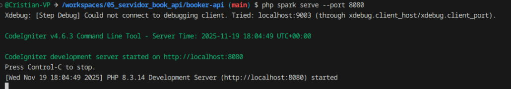

La configuración del entorno se realizó editando el archivo .env para activar el modo development y para declarar la conexión SQLite, apuntando al archivo booker.db dentro de writable. Esta elección enfatiza un flujo de trabajo seguro y portable, donde las credenciales no se versionan y el entorno gobierna la configuración.

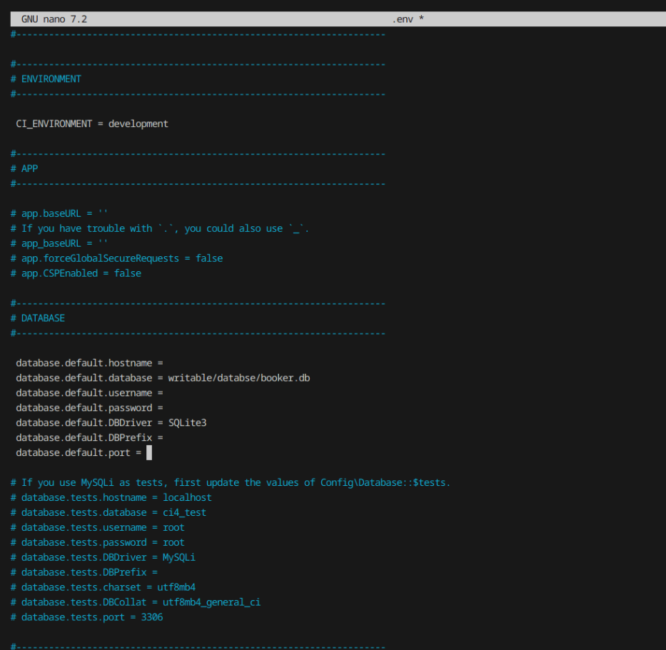

Durante la fase de enrutado se validaron las rutas generadas para el recurso de reservas. Es importante observar que el recurso REST debe asociarse explícitamente al controlador ReservationController para evitar que el router infiera un nombre distinto.

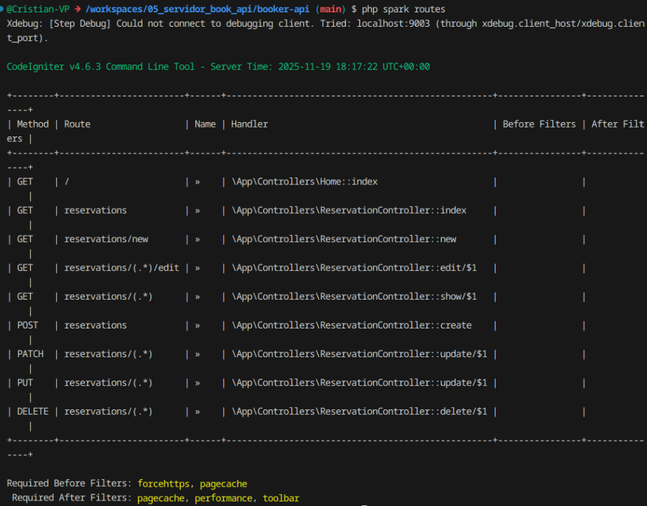

Las migraciones desempeñaron un papel clave para fijar el contrato de la base de datos. Al ejecutar la migración de la tabla reservations, se comprobó la creación del esquema en el archivo SQLite y se pudo continuar con el desarrollo del modelo y del controlador sabiendo que la estructura persistente era estable y versionada.

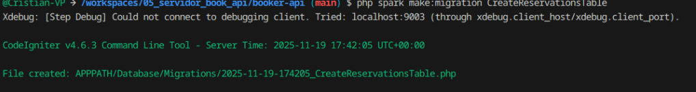

Antes de ajustar las rutas, el primer intento sobre /reservations devolvió un 404 porque el router buscaba un controlador pluralizado diferente. Este incidente se dejó adrede en la narrativa porque refleja un caso real de depuración en CodeIgniter y muestra cómo una definición explícita del controlador en la ruta resource resuelve el conflicto.

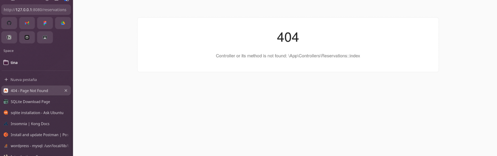

Para validar la API se configuró Postman con un entorno llamado Codespace Development que contiene una variable base_url con la dirección pública del Codespace. A partir de ahí, todas las peticiones de la colección apuntan a {{base_url}} y se vuelven portables entre máquinas y sesiones.

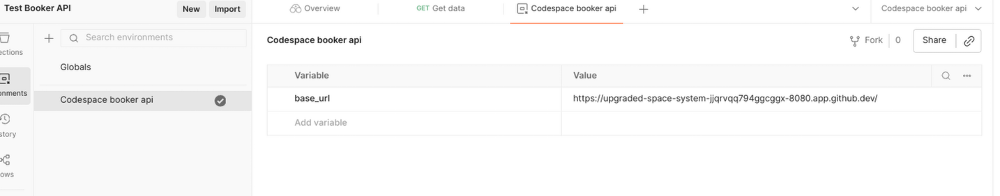

La primera comprobación consistió en listar las reservas cuando aún no existían datos. Esta petición confirmó el wiring del router, el controlador y la conexión a la base de datos mediante una respuesta JSON vacía.

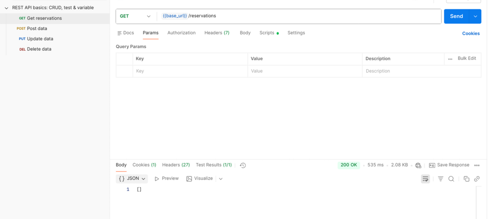

Después se creó la primera reserva con POST enviando un cuerpo JSON con nombre del cliente, email, teléfono, fecha, hora, número de personas, mesa asignada y estado. La respuesta 201 con el objeto creado y sus timestamps verificó que el modelo aplica las reglas de validación y que los timestamps se gestionan de forma automática.

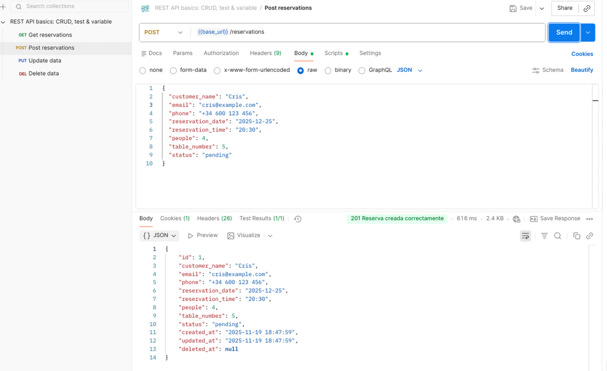

Con la reserva creada, se consultó por identificador para obtener los detalles y corroborar que el registro persistía correctamente en la base de datos.

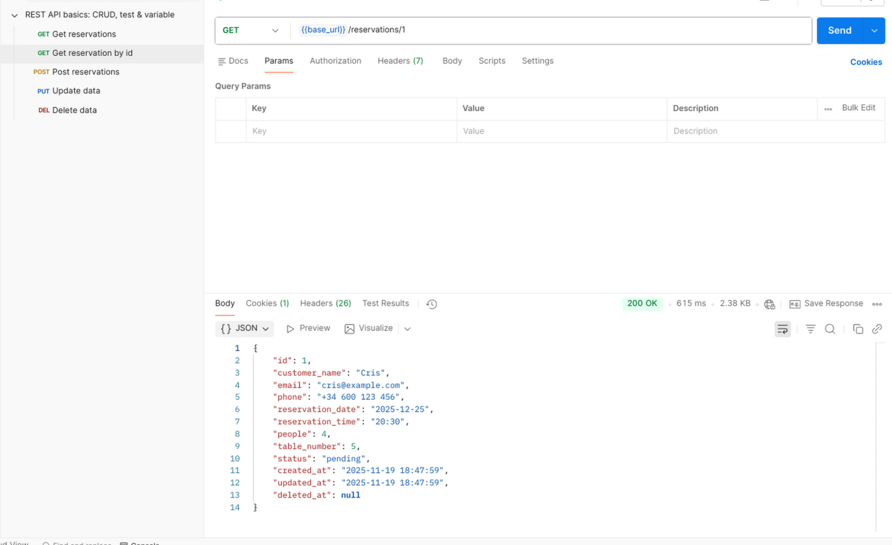

El siguiente paso fue actualizar la reserva con PUT para cambiar el horario, el número de personas y el estado. La respuesta 200 y el updated_at modificado evidencian que el flujo de actualización funciona y que el controlador devuelve el recurso actualizado en JSON.

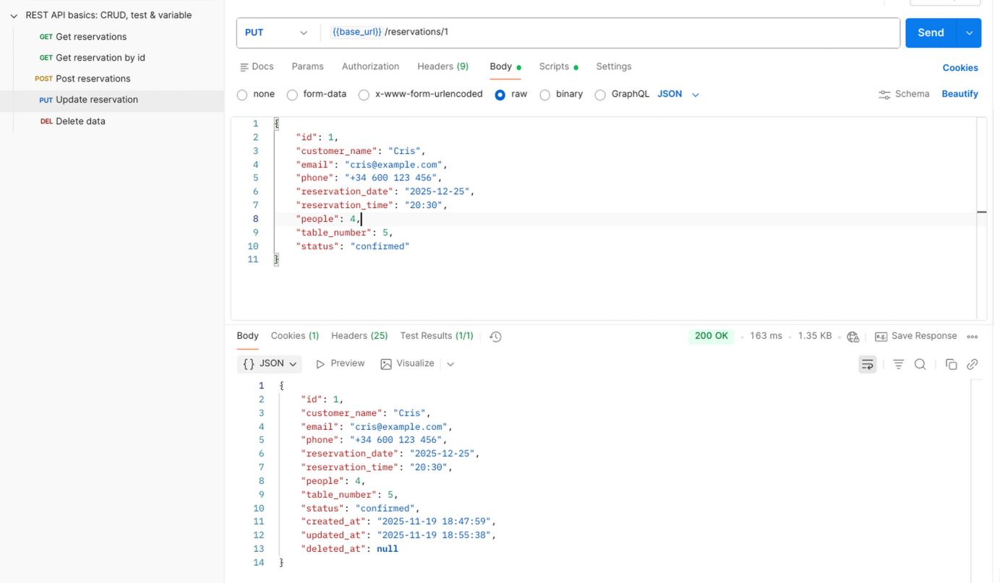

Para completar el CRUD se eliminó la reserva con DELETE. El proyecto implementa soft deletes, por lo que la fila no desaparece físicamente y futuras consultas por id devuelven 404, respetando las mejores prácticas de borrado lógico en aplicaciones donde interesa conservar el historial.

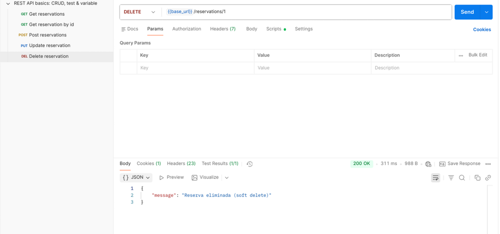

La narrativa también registra escenarios negativos. Se disparó una validación por email inválido para constatar que el backend responde con códigos y mensajes coherentes. Estos casos son imprescindibles para enseñar cómo se manejan errores de entrada y para que Postman actúe como documentación ejecutable.

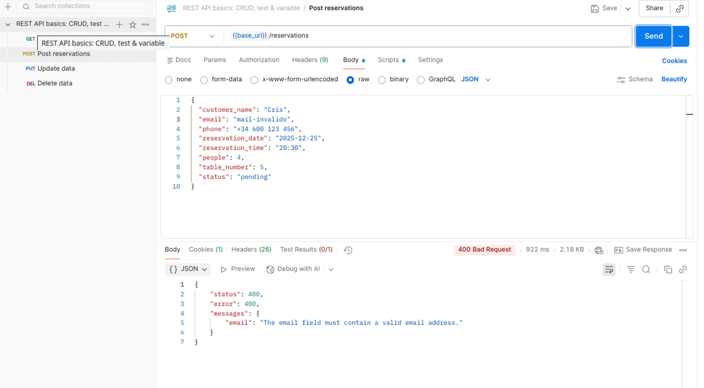

Igualmente se verificó el 404 al consultar un identificador inexistente, lo que demuestra que el controlador maneja adecuadamente los recursos no encontrados y mantiene la semántica HTTP.

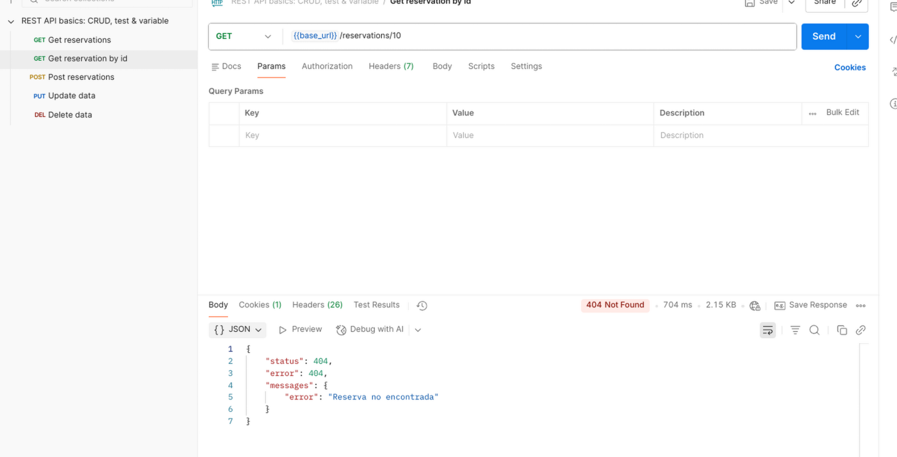

En un último experimento se forzó un error de servidor al enviar un estado vacío, registrado como referencia en el ciclo de pruebas para discutir cómo mejorar los mensajes y reforzar las reglas de validación en el modelo y, si hiciera falta, con validadores personalizados.

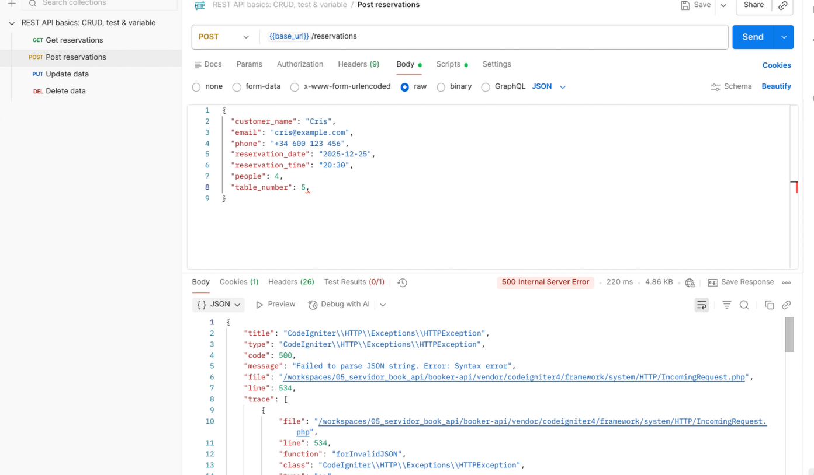
